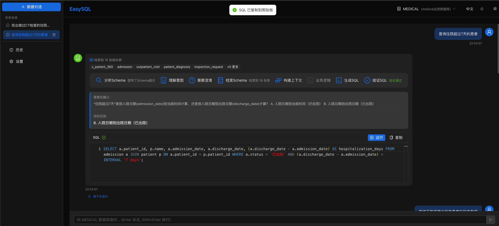

<div align="center">
  
  <h1>EasySQL</h1>
</div>

> ⚠️ **开发中** - 本项目仍在积极开发阶段，API 和功能可能会有变动。欢迎试用和反馈！

面向企业场景的 Text2SQL 方案，用 Neo4j 存表关系、用 Milvus 做语义检索，解决「表太多 LLM 不知道该查哪张」的问题。

<div align="center">

[](https://www.python.org/downloads/)
[](https://opensource.org/licenses/Apache-2.0)
[](https://github.com/psf/black)

</div>

[English](docs/README_EN.md)

---

## 界面预览



---

## 为什么做这个？

企业数据库动辄几百张表，直接把 Schema 塞给 LLM 会遇到：
- Token 爆炸，塞不下
- 表名相似，LLM 选错
- 外键关系丢失，JOIN 写不对

EasySQL 的思路：
1. 用 **Neo4j** 把表结构、外键关系存成图，查询时按图索骥
2. 用 **Milvus** 做语义向量检索，根据问题找相关的表
3. 用 **LangGraph** 串起来：分析问题 → 检索 Schema → 生成 SQL → 验证 → 自动修复

## 主要功能

- **多数据库**：MySQL、PostgreSQL、Oracle、SQL Server
- **语义检索**：问「查一下本月销量」，能找到 `order_detail` 而不是只匹配表名
- **自动修复**：SQL 执行报错会自动分析并重试
- **代码上下文**：可选功能，能读取业务代码里的枚举定义辅助生成
- **可观测**：集成 LangFuse，能看到每次调用的 Token 消耗和耗时

## 快速开始

### 环境要求

- Python 3.10+
- Neo4j 4.0+
- Milvus 2.0+

### 安装

```bash
git clone https://github.com/your-org/easysql.git
cd easysql
pip install -r requirements.txt
```

### 配置

```bash
cp .env.example .env
# 编辑 .env，填入数据库连接信息和 API Key
```

主要配置项：
```ini
# 要分析的业务数据库
DB_HIS_TYPE=mysql
DB_HIS_HOST=localhost
DB_HIS_DATABASE=your_db

# 基础设施
NEO4J_URI=bolt://localhost:7687
MILVUS_URI=http://localhost:19530

# LLM（三选一，按优先级自动选择）
OPENAI_API_KEY=sk-xxx
# GOOGLE_API_KEY=xxx
# ANTHROPIC_API_KEY=xxx
```

### 初始化 Schema

首次运行需要把数据库 Schema 同步到 Neo4j 和 Milvus：

```bash
python main.py run
```

### 启动服务

```bash
# API 服务
uvicorn easysql_api.app:app --port 8000 --reload

# 前端（可选）
cd easysql_web && npm install && npm run dev
```

访问 http://localhost:8000/docs 查看 API 文档。

## 项目结构

```
easysql/           # 核心逻辑
  ├── config.py    # 配置管理
  ├── llm/         # LangGraph Agent
  ├── retrieval/   # Schema 检索
  └── extractors/  # 数据库 Schema 提取
easysql_api/       # FastAPI 接口
easysql_web/       # React 前端
```

## 开发

```bash
# 格式化
black .
ruff check . --fix

# 类型检查
mypy easysql

# 测试
pytest
```

## License

Apache 2.0
