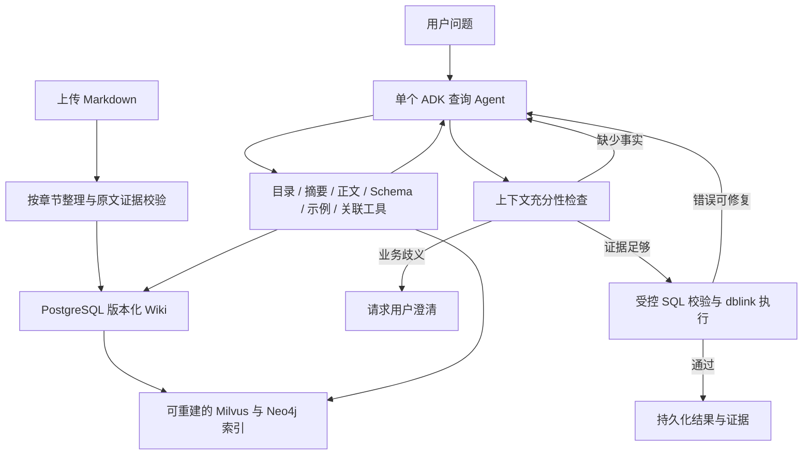

# ADK Agent 与增量 Wiki

目标：Markdown 上传后由 LLM 整理成有来源的分层 Wiki；独立的单个 ADK Agent 自主调用上下文工具并完成支持 dblink 的 Text2SQL。LangGraph 保留为历史实现。

新代码集中在 `easysql_agentic/`。复用现有配置、SQLAlchemy 控制面引擎、Schema 检索服务和 dblink 执行器；ADK Runner、FunctionTool 和 DatabaseSessionService 负责模型循环、工具调用和持久会话。

Wiki 读取分为领域目录、页面摘要、页面正文及原文证据。新增来源累积，同一来源的新版本原子替换其页面；失败不改变已发布版本。关系条目使用完整数据库标识和复合字段对。

实施验证清单：

- [x] Markdown 上传、LLM 结构化整理、来源验证。
- [x] 原子增量发布、版本历史、幂等重传、删除与索引重试。
- [x] 分层 Wiki 浏览、摘要检索、按需正文加载。
- [x] 独立单 ADK Agent，Schema、知识、示例、跨库关系均为工具。
- [x] dblink SQL 校验、执行范围和预算约束。
- [x] 当前 API 默认走 ADK，追问、澄清、分支和进度可用。
- [x] 前端上传及 Wiki 阅读入口。
- [x] PostgreSQL 迁移、真实 ADK Runner 与真实 dblink 的集成验证。

## 完成后的流程



文档整理是知识发布操作，查询时不重新整理所有文档。查询循环由一个 Agent 自主选择工具；SQL 解析、范围检查、只读事务、证据版本检查和执行预算由程序控制。

跨库图谱同时保留物理外键和文档声明的业务关联。表标识带数据库和 Schema，复合关联保留全部字段对；关系的业务条件、基数和粒度不会在寻路时被省略。名称相同或路径最短都不能直接证明业务上可以连接。

一个主库能够访问其余选中库即可进行多 dblink 联查，无需所有库相互连通。状态界面列出可用主库，Agent 检查有向通路后选择执行入口。

## 验证结果

本次完整测试：**234 passed，2 skipped**。使用临时 PostgreSQL 集群运行迁移、Wiki、持久 ADK 会话和真实三库 dblink 测试；没有借用应用配置中的业务库和控制面数据库。

```bash
PYTHON_DOTENV_DISABLED=1 EASYSQL_AGENTIC_TEST_POSTGRES=1 PYTHONDONTWRITEBYTECODE=1 \
  .venv/bin/python -m pytest -q -p no:cacheprovider tests --tb=short
```

`PYTHON_DOTENV_DISABLED=1` 用于阻止第三方依赖在导入时将本地 `.env` 注入测试进程。应用自身的配置加载不受这个测试命令替代。两个跳过项属于原有可选基础设施测试。

| 检查 | 结果 |
| --- | --- |
| 真实 ADK Runner，确定性测试模型 | 工具调用、完成门槛、澄清、错误及预算测试通过 |
| PostgreSQL 与 HTTP 集成 | 上传、版本替换、幂等、删除后重建、失败保留旧版、锁冲突、索引重试、会话恢复、追问、分支与 fork 通过 |
| 跨库执行与路由 | 真实 PostgreSQL 三库连接、只读执行、失败清理和远端字段校验通过；单主库就绪状态另有回归测试 |
| 现有配置的真实 LLM 整理 MD | 提取 2 个页面及 1 条跨库关联规则，原文引用全部匹配 |
| 现有配置的真实 LLM 查询 | 5 次模型调用、12 次工具调用，自主读取知识和 Schema、查找关联并提交通过验证的 dblink SQL |
| 浏览器操作 | 上传 v1、同来源更新 v2、分层领域导航、Markdown 正文和原文引用展示通过 |
| Python Ruff、目标前端 ESLint、依赖检查 | 通过；`pip check` 无依赖冲突 |
| 前端生产构建 | 通过，仍有现有的单个产物超过 500 kB 提示 |

真实模型查询使用隔离测试库和已验证的 Wiki 测试资料；真实模型的 Markdown 整理另行验证。Neo4j/Milvus 投影有测试及失败回退，本次没有对实际运行中的 Neo4j/Milvus 服务做联通验证。

## 使用入口与边界

完整启动、配置复用、API 和目录说明见 [独立 ADK Agent 使用文档](../easysql_agentic/README.md)。可先上传 [跨数据库 Markdown 示例](../examples/knowledge/multi-database-wiki.md)，将其中数据库别名和表字段改成自己的真实配置。

部署到现有控制面时需要先运行 `alembic upgrade head`。本次只在隔离测试库验证了迁移，没有迁移当前应用配置中的控制面数据库。

当前 dblink 后端为 PostgreSQL 到 PostgreSQL；Oracle `table@link` 不在本次实现范围。上传 MD 建立的是知识库及其图谱，不会替用户在业务数据库执行建表或改表。
