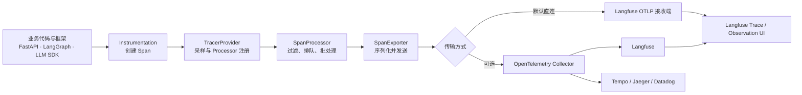
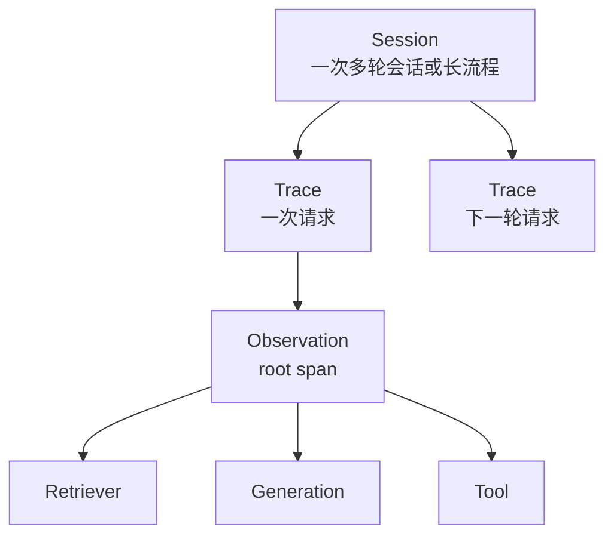
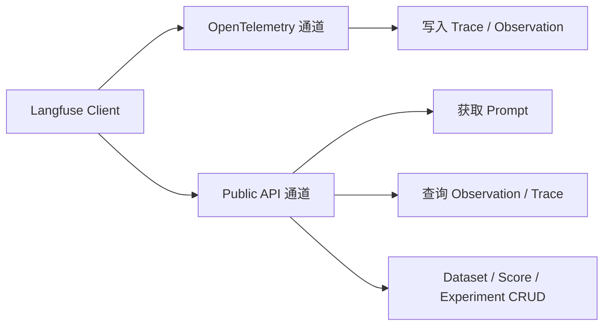

# Langfuse × OpenTelemetry 学习手册

> 面向公司内部文档审核、LangGraph/LLM 应用和多部门多 Project 场景
>
> 官方资料核实日期：2026-07-25
>
> 本地环境快照：Langfuse Python SDK `4.2.0`，OpenTelemetry Python `1.41.0`

---

## 0. 阅读说明

这份手册要解决四类问题：

1. OpenTelemetry 到底是什么，Trace、Span、Context、OTLP、Collector 等概念如何关联；
2. Langfuse 如何建立在 OpenTelemetry 之上；
3. 为什么在 Langfuse 代码和 UI 中看不到完整的 Processor、Exporter、Collector 流程；
4. 多部门、多 Langfuse Project、并发请求时，Prompt、Trace 和上下文应如何隔离。

示例使用以下标记：

| 标记 | 含义 |
|---|---|
| **通用 OTel** | 标准 OpenTelemetry 示例，不依赖 Langfuse |
| **本地 4.2.0 可用** | 已按当前项目虚拟环境中的函数签名核对 |
| **官网当前版本** | 来自当前官网，可能要求比本地 `4.2.0` 更新的 SDK |
| **概念配置** | 用于理解架构，部署前必须按实际环境调整 |

安全约定：

- 不在代码、Span attribute、Baggage、日志和本文中写入真实 Secret Key；
- 示例统一使用环境变量或 `[REDACTED_SECRET]`；
- 文档正文、合同条款、个人信息等敏感数据默认不写入 Trace；
- `department_id` 必须来自认证后的服务端授权上下文，不能直接信任请求体。

---

## 1. 最重要的一张图



一句话记忆：

```text
Instrumentation 产生数据
Context 关联数据
SDK 采样、处理和排队
Exporter 发送数据
OTLP 规定怎样传输
Collector 可选地接收、处理和分发
Langfuse 存储、分析并展示 LLM 观测数据
```

官方依据：

- [OpenTelemetry：What is OpenTelemetry?](https://opentelemetry.io/docs/what-is-opentelemetry/)
- [OpenTelemetry Collector](https://opentelemetry.io/docs/collector/)
- [Langfuse Observability Data Model](https://langfuse.com/docs/observability/data-model)
- [Langfuse OpenTelemetry Integration](https://langfuse.com/integrations/native/opentelemetry)

---

# 第一部分：OpenTelemetry

## 2. OpenTelemetry 是什么

OpenTelemetry，简称 OTel，是一套厂商中立的可观测性标准和工具集合。它主要提供：

- API：业务代码和框架如何创建遥测数据；
- SDK：如何采样、处理、排队和导出遥测数据；
- Instrumentation：对 FastAPI、HTTP Client、数据库、LLM SDK 等自动或手动插桩；
- Semantic Conventions：字段应该叫什么、代表什么；
- Context Propagation：如何让跨函数、线程、协程、进程和服务的 Span 保持父子关系；
- OTLP：如何在 SDK、Collector 和后端之间传输数据；
- Collector：如何集中接收、处理和转发遥测数据。

OpenTelemetry **不是**：

- Trace 数据库；
- 最终分析平台；
- 日志搜索 UI；
- 告警系统；
- Langfuse、Tempo、Jaeger 或 Datadog 的替代品。

OTel 负责标准化地产生、关联和搬运数据；真正的存储、查询和展示由观测后端完成。

---

## 3. OpenTelemetry 的信号

OpenTelemetry 当前主要处理以下信号：

| 信号 | 回答的问题 | 文档审核项目示例 |
|---|---|---|
| Traces | 一次请求经过了哪些步骤，各步骤耗时和错误是什么 | 上传文档 → OCR → 检索制度 → LLM 审核 → 入库 |
| Metrics | 一段时间内系统整体表现如何 | 每分钟审核数、P95 延迟、错误率、队列深度 |
| Logs | 某个时间点发生了什么 | OCR 失败、数据库超时、模型返回格式错误 |
| Profiles | CPU/内存时间花在哪里 | 当前仍属于发展中的 OTel 信号 |

Langfuse 当前的原生 OTLP 接入重点是 **Trace ingestion**。Langfuse 自己的 Metrics API 是对 Langfuse Observation、用量、成本和 Score 做聚合查询，不能把它等同于“Langfuse 接收任意 OTLP Metrics”。

---

## 4. Trace、Span 和 Observation

### 4.1 Trace

Trace 表示一次端到端操作，由一组共享同一 `trace_id` 的 Span 组成。

在文档审核系统中，一次 Trace 可以是：

```text
用户提交一份制度文件
  → 解析文件
  → OCR
  → 从部门知识库检索规则
  → LLM 审核
  → 结构化校验
  → 保存审核结果
```

### 4.2 Span

Span 表示 Trace 中一个有开始时间和结束时间的工作单元。

一个 Span 通常包括：

- `name`；
- `trace_id`；
- `span_id`；
- `parent_span_id`；
- 开始和结束时间；
- attributes；
- events；
- status；
- links；
- instrumentation scope；
- resource。

### 4.3 Trace 树

```text
Trace ID: 4bf92f3577b34da6a3ce929d0e0e4736

POST /document-reviews                      parent=None
├── load-document                          parent=POST
├── OCR                                    parent=POST
├── retrieve-department-policies           parent=POST
│   ├── embed-query                        parent=retrieve
│   └── milvus-search                      parent=retrieve
├── LLM-document-review                    parent=POST
└── persist-review-result                  parent=POST
```

这里每个节点有自己的 `span_id`，但共享同一个 `trace_id`。

### 4.4 Langfuse 的对应关系

```text
OpenTelemetry                        Langfuse
────────────────────────────────────────────────
共享 trace_id 的一组 Span       →   一个 Trace
单个 Span                       →   一个 Observation
LLM 类型的 Span                 →   Generation
parent_span_id                  →   Observation 父子关系
Span attributes                →   input/output/model/metadata 等
```

一个容易忽略的事实是：

> OTLP Exporter 主要发送 Span；Langfuse 服务端再根据 `trace_id`、`span_id` 和 `parent_span_id` 重建 Trace。

Langfuse v4 进一步采用 observations-first 数据模型：Observation 是主要可查询对象，Trace 是共享 `trace_id` 的 Observation 集合。详见 [Langfuse v4](https://langfuse.com/docs/v4)。

---

## 5. Span 中的其他核心概念

| 概念 | 含义 | 文档审核示例 |
|---|---|---|
| Attribute | 可检索的键值数据 | `document.type=contract` |
| Event | Span 内某个时间点发生的事件 | `validation.retry` |
| Status | Span 的执行状态 | `ERROR` |
| Link | 与另一个 Span 的非父子关联 | 批处理任务关联多个上游 Trace |
| Resource | 描述产生遥测数据的服务/进程 | `service.name=document-review-api` |
| Instrumentation Scope | 表示由哪个库/模块创建 Span | `langfuse-sdk`、FastAPI instrumentation |
| SpanContext | Trace ID、Span ID、采样标志等传播信息 | 当前请求的追踪身份 |
| Baggage | 随 Context 跨边界传播的键值数据 | 低敏的租户路由信息 |
| Semantic Conventions | 跨工具统一的属性命名约定 | `service.name`、`gen_ai.*` |

### Attribute 和 Baggage 的区别

```text
Attribute
  └─ 属于某个具体 Span
  └─ 默认不会自动传播到子 Span

Baggage
  └─ 属于传播 Context
  └─ 可以跨函数和服务传播
  └─ 必须通过 Processor/Instrumentation 复制到 Span attribute 才能被后端查询
```

安全提醒：

- 不要把 Secret Key 放进 Baggage；
- 不要把完整文档正文放进 Baggage；
- Baggage 可能随 HTTP header 传播到下游服务；
- 使用 Baggage 前要明确允许传播的字段清单。

---

## 6. Context 和 Context Propagation

### 6.1 当前 Span

`start_as_current_span()` 会把新 Span 放进当前 Context。之后创建的 Span 会自动以它为父 Span：

```python
with tracer.start_as_current_span("document-review"):
    with tracer.start_as_current_span("retrieve-policy"):
        ...

    with tracer.start_as_current_span("llm-review"):
        ...
```

结果：

```text
document-review
├── retrieve-policy
└── llm-review
```

### 6.2 AsyncIO

在正常的 Python `asyncio` 调用链中，当前 OTel Context 通常通过 `contextvars` 传播：

```python
import asyncio

from opentelemetry import trace

tracer = trace.get_tracer(__name__)


async def retrieve_policy() -> None:
    with tracer.start_as_current_span("retrieve-policy"):
        await asyncio.sleep(0.01)


async def run_review() -> None:
    with tracer.start_as_current_span("document-review"):
        await retrieve_policy()
```

这意味着并发协程通常可以各自维护当前 Span，但前提是：

- 框架没有错误地共享或覆盖 Context；
- 后台线程/任务创建方式正确传播 Context；
- 没有把“当前部门”实现成可变全局变量。

### 6.3 跨服务传播

跨 HTTP 服务时通常使用 W3C Trace Context：

```http
traceparent: 00-4bf92f3577b34da6a3ce929d0e0e4736-00f067aa0ba902b7-01
```

下游服务提取这个 header 后，可以继续创建属于同一 Trace 的子 Span。

必须区分：

```text
OTel Trace Context
  └─ 负责 trace_id、span_id、parent_id 和采样标志

Langfuse Project Context
  └─ 负责选哪个 Project、哪组 API Key、哪个 Exporter
```

Trace Context 不会自动替你选择 Langfuse Project。

官方依据：

- [OpenTelemetry Context Propagation](https://opentelemetry.io/docs/concepts/context-propagation/)
- [OpenTelemetry Traces](https://opentelemetry.io/docs/concepts/signals/traces/)

---

## 7. OpenTelemetry API 与 SDK

### API

API 是 Instrumentation 使用的稳定接口，例如：

```python
from opentelemetry import trace

tracer = trace.get_tracer(__name__)
```

库作者一般只依赖 API，而不强制应用使用某个具体后端。

### SDK

SDK 是 API 的具体实现，负责：

- 创建真正可记录的 Span；
- 采样；
- Resource；
- SpanProcessor；
- 批处理队列；
- Exporter；
- `force_flush()`；
- `shutdown()`。

如果只安装 API、没有配置 SDK，很多 API 操作可能成为 no-op。

---

## 8. TracerProvider、Tracer、Processor 和 Exporter

### 8.1 TracerProvider

TracerProvider 是进程内 Trace SDK 的核心容器：

```text
TracerProvider
├── Resource
├── Sampler
├── SpanProcessor A
├── SpanProcessor B
└── Tracer...
```

通常一个应用统一管理全局 TracerProvider，避免多个框架争抢全局配置。

### 8.2 Tracer

Tracer 用于创建 Span：

```python
tracer = provider.get_tracer("document-review")
```

Instrumentation scope 通常来自 Tracer 名称和版本。

### 8.3 SDK SpanProcessor

SpanProcessor 订阅 Span 生命周期：

```text
Span 开始 → processor.on_start()
Span 结束 → processor.on_end()
```

常见实现：

| Processor | 行为 | 适合 |
|---|---|---|
| `SimpleSpanProcessor` | Span 结束后立即同步调用 Exporter | 本地演示、调试 |
| `BatchSpanProcessor` | Span 进入队列，后台批量调用 Exporter | 生产服务 |
| `LangfuseSpanProcessor` | Langfuse 项目过滤、LLM Span 过滤和批处理 | Langfuse SDK |

### 8.4 SpanExporter

Exporter 负责把已经结束的 Span 发送出去：

```text
BatchSpanProcessor
      ↓ export(batch)
OTLPSpanExporter
      ↓ OTLP/HTTP 或 OTLP/gRPC
Collector / Backend
```

Exporter 不负责创建 Span，也不决定业务父子关系。

---

## 9. 通用 OTel 实验：在控制台查看 Span

**标记：通用 OTel，可直接本地学习。**

```python
from opentelemetry import trace
from opentelemetry.sdk.resources import Resource
from opentelemetry.sdk.trace import TracerProvider
from opentelemetry.sdk.trace.export import (
    ConsoleSpanExporter,
    SimpleSpanProcessor,
)
from opentelemetry.trace import Status, StatusCode


resource = Resource.create(
    {
        "service.name": "document-review-demo",
        "service.version": "1.0.0",
        "deployment.environment.name": "development",
    }
)

provider = TracerProvider(resource=resource)
provider.add_span_processor(
    SimpleSpanProcessor(ConsoleSpanExporter())
)

# 一个进程一般只设置一次全局 Provider。
trace.set_tracer_provider(provider)
tracer = trace.get_tracer("document-review-learning")

with tracer.start_as_current_span("review-document") as root_span:
    root_span.set_attribute("document.type", "policy")
    root_span.set_attribute("department.alias", "legal")

    with tracer.start_as_current_span("retrieve-policy") as retrieve_span:
        retrieve_span.set_attribute("retrieval.top_k", 8)
        retrieve_span.add_event("milvus.search.completed")

    with tracer.start_as_current_span("llm-review") as llm_span:
        llm_span.set_attribute("gen_ai.request.model", "example-model")
        llm_span.set_status(Status(StatusCode.OK))

provider.force_flush()
provider.shutdown()
```

运行后重点观察：

- 三个 Span 是否共享一个 `trace_id`；
- 两个子 Span 的 `parent_id` 是否指向 root Span；
- Resource 是否出现在每个导出的 Span 上；
- attributes 与 events 分别位于哪里。

---

## 10. OTLP 是什么

OTLP 是 OpenTelemetry Protocol。

它定义：

- 遥测数据的 Protobuf 数据结构；
- Export 请求和响应；
- OTLP/gRPC；
- OTLP/HTTP；
- trace、metric、log 等 signal 的默认路径；
- 压缩、错误、部分成功、重试等语义。

### 常见端口和路径

| 形式 | 常见默认值 |
|---|---|
| OTLP/gRPC | `4317` |
| OTLP/HTTP | `4318` |
| Trace HTTP 路径 | `/v1/traces` |
| Metrics HTTP 路径 | `/v1/metrics` |
| Logs HTTP 路径 | `/v1/logs` |

例如：

```text
http://otel-collector:4318/v1/traces
```

OTLP 是协议，不是一个独立运行的服务：

```text
错误理解：OTLP = Collector
正确理解：Collector 可以使用 OTLP 接收和发送数据
```

官方依据：[OTLP Specification](https://opentelemetry.io/docs/specs/otlp/)。

---

## 11. OpenTelemetry Collector

Collector 是一个可独立部署的可执行程序。

### 11.1 基本管道

```text
Receiver → Processor(s) → Exporter(s)
```

| Collector 组件 | 职责 | 常见例子 |
|---|---|---|
| Receiver | 接收或抓取遥测数据 | `otlp`、`zipkin`、`prometheus` |
| Processor | 转换、过滤、采样、批处理 | `memory_limiter`、`batch`、`filter`、`transform`、`tail_sampling` |
| Exporter | 发往后端 | `otlphttp`、`otlp`、`debug` |
| Connector | 把一条 pipeline 的输出连接到另一条 pipeline 的输入 | traces-to-metrics 等 |
| Extension | 健康检查、认证、存储等辅助能力 | `health_check`、`file_storage` |

### 11.2 SDK Processor 与 Collector Processor 不是一回事

```text
应用进程
  └─ BatchSpanProcessor / LangfuseSpanProcessor
       ↓ OTLP

Collector 进程
  └─ memory_limiter → transform → batch → tail_sampling
       ↓

观测后端
```

二者可以同时存在。

### 11.3 为什么需要 Collector

适合使用 Collector 的情况：

- 多个服务统一发送遥测；
- 同一份 Trace 扇出到多个后端；
- 统一重试、队列和批处理；
- 集中脱敏；
- 尾部采样；
- 应用不能直接访问外部观测平台；
- 需要统一认证和出口策略。

简单开发环境可以直接向后端导出，不是所有 Langfuse 部署都必须有 Collector。

官方依据：

- [OpenTelemetry Collector](https://opentelemetry.io/docs/collector/)
- [Collector Architecture](https://opentelemetry.io/docs/collector/architecture/)
- [Collector Components](https://opentelemetry.io/docs/collector/components/)

---

## 12. Collector 最小配置

**标记：概念配置。**

```yaml
receivers:
  otlp:
    protocols:
      grpc:
        endpoint: 0.0.0.0:4317
      http:
        endpoint: 0.0.0.0:4318

processors:
  memory_limiter:
    check_interval: 5s
    limit_mib: 512
    spike_limit_mib: 128
  batch:

exporters:
  # 只建议在本地调试时使用，可能打印敏感 input/output。
  debug:
    verbosity: detailed

service:
  pipelines:
    traces:
      receivers: [otlp]
      processors: [memory_limiter, batch]
      exporters: [debug]
```

应用把 Span 发到：

```text
http://localhost:4318/v1/traces
```

Collector 收到后通过 `debug` exporter 输出。

---

## 13. 用 Python 把 Span 发给 Collector

**标记：通用 OTel。**

```python
from opentelemetry import trace
from opentelemetry.exporter.otlp.proto.http.trace_exporter import (
    OTLPSpanExporter,
)
from opentelemetry.sdk.resources import Resource
from opentelemetry.sdk.trace import TracerProvider
from opentelemetry.sdk.trace.export import BatchSpanProcessor


provider = TracerProvider(
    resource=Resource.create(
        {"service.name": "document-review-api"}
    )
)

exporter = OTLPSpanExporter(
    endpoint="http://localhost:4318/v1/traces",
)

provider.add_span_processor(
    BatchSpanProcessor(exporter)
)
trace.set_tracer_provider(provider)

tracer = trace.get_tracer(__name__)

with tracer.start_as_current_span("review-document"):
    ...

provider.force_flush()
provider.shutdown()
```

这里的调用路径是：

```text
Span
  → BatchSpanProcessor
  → OTLPSpanExporter
  → Collector OTLP Receiver
  → Collector Processors
  → Collector Exporters
```

---

## 14. 采样

采样决定哪些 Trace 被记录或导出。

### Head Sampling

在 Trace 开始时决定是否采样：

```text
优点：开销低
缺点：决定时还不知道后续是否出错
```

Langfuse `sample_rate` 属于这类应用 SDK 侧采样配置。

### Tail Sampling

在看到完整或大部分 Trace 后决定：

```text
优点：可以保留错误、慢请求、特定部门请求
缺点：需要 Collector 缓冲更多数据
```

通常由 Collector 的 `tail_sampling` processor 完成。

多平台导出时要考虑采样一致性：

- 如果应用 SDK 已经 head-sample 丢掉 Trace，Collector 无法恢复；
- 不同 Processor 使用不同采样策略，两个平台看到的 Trace 集合可能不同；
- 过滤子 Span 但保留根 Span，可能产生不完整 Trace；
- 过滤根 Span可能导致 Langfuse 无法正确建立 Trace。

---

# 第二部分：Langfuse

## 15. Langfuse 是什么

Langfuse 是面向 LLM/Agent 应用的工程平台，主要能力包括：

- LLM Observability；
- Prompt Management；
- Scores；
- Datasets；
- Experiments；
- Annotation Queues；
- LLM-as-a-Judge；
- 成本、Token 和延迟分析；
- Public API；
- 团队和 Project 访问控制。

它和通用 APM 的关注点不同：

| Langfuse 更关注 | Tempo/Jaeger/Datadog 更关注 |
|---|---|
| Prompt、模型输入输出 | 微服务调用链 |
| Generation、Token、成本 | HTTP、数据库、队列 |
| Score 与人工反馈 | 错误率与基础设施 |
| Dataset、Experiment | 系统拓扑与性能 |
| Prompt 版本关联 | 通用服务指标 |

二者可以共享 OpenTelemetry Trace，但不会自动拥有完全相同的领域能力。

---

## 16. Organization、Project、API Key

### Organization

Organization 是组织层级容器，包含多个 Project 和成员。

### Project

Project 是 Langfuse 中非常重要的数据和访问控制边界：

- Trace 属于某个 Project；
- Prompt 属于某个 Project；
- Dataset 属于某个 Project；
- Experiment 属于某个 Project；
- Score 属于某个 Project；
- Project API Key 访问对应 Project 的数据。

### API Key

Langfuse Project API 使用 Basic Auth：

```text
username = Public Key
password = Secret Key
```

Public Key 不是 Secret，但仍应由服务端配置管理；Secret Key 必须严格保密。

关键结论：

> 一个 Langfuse Client 使用哪组 Public/Secret Key，就决定它从哪个 Project 获取 Prompt、向哪个 Project 写 Trace，以及查询哪个 Project 的数据。

Labels、Prompt 名称前缀和 tags 不是安全隔离边界。需要真正的数据隔离时，应使用 Project、Organization、独立实例或独立服务进程。

官方依据：

- [Langfuse Public API](https://langfuse.com/docs/api-and-data-platform/features/public-api)
- [Langfuse RBAC](https://langfuse.com/docs/administration/rbac)

---

## 17. Langfuse 数据模型



### Session

把多次 Trace 组成一次会话或长流程，例如同一份文档的多轮追问。

### Trace

通常代表一次请求或操作，由共享 `trace_id` 的 Observations 组成。

### Observation

Trace 中的一个步骤。常见类型包括：

- `span`；
- `generation`；
- `embedding`；
- `agent`；
- `tool`；
- `chain`；
- `retriever`；
- `evaluator`；
- `guardrail`。

### Generation

Generation 是专门描述模型调用的 Observation，通常包含：

- model；
- model parameters；
- input；
- output；
- token usage；
- cost；
- prompt；
- completion start time。

### 常见 Trace 属性

| 属性 | 用途 |
|---|---|
| `user_id` | 标识最终用户，建议使用内部不可逆标识 |
| `session_id` | 关联多次 Trace |
| `tags` | 请求发生时已知的分类 |
| `metadata` | 自定义键值信息 |
| `environment` | production/staging/development |
| `release` | 应用发布版本 |
| `version` | 工作流或组件版本 |

---

## 18. Langfuse 建立在 OpenTelemetry 之上

Langfuse Python SDK v3+ 和新版 JS/TS SDK 使用 OpenTelemetry 作为 Trace 基础。

当前项目中的 Langfuse Python SDK `4.2.0` 默认流程为：

```text
Langfuse()
  └─ LangfuseResourceManager
      ├─ 获取或创建 TracerProvider
      ├─ 创建 LangfuseSpanProcessor
      │   └─ 继承 BatchSpanProcessor
      ├─ 创建 OTLPSpanExporter
      ├─ 注册 Processor
      └─ 创建 Langfuse Tracer
```

本地源码位置：

```text
.venv/lib/python3.14/site-packages/langfuse/_client/resource_manager.py
.venv/lib/python3.14/site-packages/langfuse/_client/span_processor.py
```

本地实现确认：

- `LangfuseSpanProcessor` 继承 OTel `BatchSpanProcessor`；
- 默认创建 OTel `OTLPSpanExporter`；
- 默认 trace endpoint 是：

```text
{LANGFUSE_BASE_URL}/api/public/otel/v1/traces
```

- 使用 Project Public/Secret Key 生成 Basic Auth；
- Span 在应用进程中批量排队和后台导出；
- 初始化时把 Processor 注册到 TracerProvider；
- `flush()` 最终调用 TracerProvider 的 `force_flush()`。

因此默认路径是：

```text
应用
  → LangfuseSpanProcessor
  → OTLPSpanExporter
  → Langfuse OTLP endpoint
```

默认 **没有** OpenTelemetry Collector。

---

## 19. 为什么在 Langfuse 中看不见 Processor 和 Exporter

主要原因：

1. `Langfuse()` 自动组装了底层 OTel SDK；
2. Processor 和 Exporter 运行在你的应用进程，而不是 Langfuse UI；
3. 默认没有独立 Collector；
4. Trace 在后台批量发送；
5. Langfuse UI 展示领域对象，而不是 SDK 队列；
6. Langfuse 服务端只知道最终收到的 Span，不知道客户端提前丢弃了什么。

如果一个 Span 没出现在 UI，可能发生在任何一层：

```text
没有创建 Span
  ↓
Context 没传播
  ↓
Sampler 丢弃
  ↓
Processor 过滤
  ↓
Batch 队列未 flush
  ↓
Exporter 网络/认证失败
  ↓
Collector 丢弃
  ↓
Langfuse ingestion 或映射问题
```

Langfuse UI 无法直接解释“到达 Langfuse 之前”的所有失败。

---

## 20. CallbackHandler 是什么

`CallbackHandler` 是框架集成层的 Instrumentation Adapter。

以 LangChain/LangGraph 为例：

```text
LangChain callback event
  ├─ on_chain_start
  ├─ on_llm_start
  ├─ on_tool_start
  └─ on_retriever_start
       ↓
CallbackHandler
       ↓
创建对应的 Langfuse/OTel Observation
```

所以：

```text
CallbackHandler ≠ SpanProcessor
CallbackHandler ≠ Exporter
CallbackHandler ≠ Collector
```

它负责把框架事件转成 Span；后续 Processor 和 Exporter 由 Langfuse Client 管理。

### 本地 4.2.0 的重要差异

当前本地版本的构造函数是：

```text
CallbackHandler(
    *,
    public_key: str | None = None,
    trace_context: TraceContext | None = None,
)
```

它不直接接收 `secret_key` 和 `base_url`。推荐先初始化对应 Client，再让 Handler 用 `public_key` 选中已经初始化的资源：

```python
import os

from langfuse import Langfuse
from langfuse.langchain import CallbackHandler


public_key = os.environ["LANGFUSE_PUBLIC_KEY"]

langfuse = Langfuse(
    public_key=public_key,
    secret_key=os.environ["LANGFUSE_SECRET_KEY"],
    base_url=os.environ["LANGFUSE_BASE_URL"],
)

handler = CallbackHandler(public_key=public_key)
```

不要根据旧版博客或旧版 SDK 示例，假定所有版本的 Handler 构造参数完全一样。

---

## 21. Langfuse 有两条不同的数据通道

这是理解 Prompt、Trace 和 OTLP 的关键。



| 操作 | 通道 |
|---|---|
| 写入 Trace/Observation | OTel Span → Processor → OTLP Exporter |
| 获取 Prompt | Langfuse Public API + SDK 本地缓存 |
| 查询 Trace/Observation | Langfuse Public API |
| 创建 Dataset Item | Langfuse Public API |
| 创建 Score | SDK/API 的 Score ingestion |
| Collector | 通常只参与 Telemetry 写入 |

因此可能出现：

```text
Prompt 获取正常，但 Trace 没上传
```

也可能出现：

```text
Trace 写入正常，但 Prompt API 请求失败
```

排错时要先判断失败的是哪条通道。

---

## 22. Langfuse Prompt Management

### Prompt 类型

Langfuse 支持：

- Text Prompt：一个字符串；
- Chat Prompt：带 role 的消息数组。

### Version

每次修改 Prompt 会创建一个新版本。版本是不可变历史：

```text
document-review/system
├── version 1
├── version 2
└── version 3
```

### Label

Label 是指向某个版本的可变指针：

```text
production → version 2
staging    → version 3
latest     → version 3
```

关键区别：

```text
Version = 不可变版本
Label   = 可移动指针
```

当前官方行为：

- 不指定 label/version 时，SDK 默认获取 `production`；
- `latest` 自动指向最新创建版本；
- 发布和回滚可以通过移动 `production` label 完成；
- Prompt 属于 Project，不能只凭名称跨 Project 查询。

### Prompt Cache

SDK 会缓存 Prompt，从而：

- 降低请求延迟；
- 降低 Langfuse 临时不可用带来的风险；
- 但 Prompt 更新后的前几个请求可能仍使用旧缓存。

多 Project 时，自建缓存键至少应包括：

```text
project_alias + prompt_name + version_or_label
```

不能只使用 `prompt_name`。

官方依据：

- [Prompt Management Overview](https://langfuse.com/docs/prompt-management/overview)
- [Prompt Data Model](https://langfuse.com/docs/prompt-management/data-model)
- [Prompt Version Control](https://langfuse.com/docs/prompt-management/features/prompt-version-control)

---

## 23. 获取和编译 Prompt

**标记：本地 4.2.0 可用。**

```python
import os

from langfuse import Langfuse


langfuse = Langfuse(
    public_key=os.environ["LANGFUSE_PUBLIC_KEY"],
    secret_key=os.environ["LANGFUSE_SECRET_KEY"],
    base_url=os.environ["LANGFUSE_BASE_URL"],
)

prompt = langfuse.get_prompt(
    "document-review/system",
    label="production",
    type="text",
    cache_ttl_seconds=60,
    fallback=(
        "你是{{department_name}}的文档审核助手。"
        "根据制度上下文审核文档。"
    ),
)

compiled_prompt = prompt.compile(
    department_name="法务部门",
)

print(prompt.name)
print(prompt.version)
print(compiled_prompt)
```

这里：

- Prompt 通过 Public API 获取；
- Prompt 由 Project API Key 确定所属 Project；
- Prompt 对象可以传给 Generation，以关联 Prompt name/version；
- `get_prompt()` 不是 OTLP 调用。

---

## 24. Scores、Datasets 和 Experiments

### Score

Score 是对输出质量的评价，可以来自：

- 用户反馈；
- 人工审核；
- LLM-as-a-Judge；
- 确定性代码检查；
- Experiment evaluator。

常见类型：

| 类型 | 示例 |
|---|---|
| NUMERIC | `citation_coverage=0.92` |
| CATEGORICAL | `risk_level=high` |
| BOOLEAN | `schema_valid=1` |
| TEXT | 审核员的定性说明 |

Score 可以关联：

- Trace；
- Observation；
- Session；
- Dataset Run/Experiment。

### Dataset

Dataset 是可复用的测试输入集合。Dataset Item 通常包含：

- input；
- expected output；
- metadata；
- source trace/observation。

### Experiment

Experiment 把某个应用、Prompt、模型或检索配置运行在 Dataset 上，然后比较 Scores。

```text
生产 bad case
  → Dataset Item
  → 候选 Prompt / 模型 / 检索配置
  → Experiment
  → Evaluators
  → Scores
  → 对比基线
  → 晋级或回滚
```

官方依据：

- [Langfuse Scores](https://langfuse.com/docs/evaluation/scores/overview)
- [Langfuse Datasets](https://langfuse.com/docs/evaluation/experiments/datasets)
- [Experiments via SDK](https://langfuse.com/docs/evaluation/experiments/experiments-via-sdk)

---

## 25. 从生产 Trace 创建 Dataset Item

**标记：本地 4.2.0 可用。**

```python
langfuse.create_dataset(
    name="document-review/legal/golden-set",
    description="法务文档审核高价值回归集",
)

langfuse.create_dataset_item(
    dataset_name="document-review/legal/golden-set",
    input={
        "document_id": "doc-safe-example",
        "document_type": "contract",
        "content_reference": "internal://redacted/doc-safe-example",
    },
    expected_output={
        "risk_codes": ["CLAUSE_MISSING"],
        "decision": "manual_review",
    },
    metadata={
        "department_alias": "legal",
        "source": "production-bad-case",
    },
    source_trace_id="<trace-id>",
    source_observation_id="<observation-id>",
)
```

建议只放：

- 可控的脱敏输入；
- 文档引用或内部 ID；
- 预期结构化结果；
- 评测所需元数据。

不要因为 Dataset 方便，就复制完整生产敏感文档。

---

## 26. 运行一个最小 Experiment

**标记：本地 4.2.0 函数签名与官网当前示例均已核对。**

```python
from langfuse import Evaluation


test_data = [
    {
        "input": {
            "document_id": "doc-1",
            "text": "示例脱敏文档",
        },
        "expected_output": {
            "decision": "manual_review",
        },
    }
]


def review_task(*, item, **kwargs):
    # 实际项目中调用完整审核链路，而不是只测试 Prompt 字符串。
    return {
        "decision": "manual_review",
    }


def decision_evaluator(
    *,
    output,
    expected_output,
    **kwargs,
):
    passed = output["decision"] == expected_output["decision"]
    return Evaluation(
        name="decision_exact_match",
        value=1.0 if passed else 0.0,
        comment="审核决策是否完全一致",
    )


result = langfuse.run_experiment(
    name="legal-document-review-smoke-test",
    data=test_data,
    task=review_task,
    evaluators=[decision_evaluator],
    max_concurrency=4,
    metadata={
        "prompt_label": "candidate",
        "retrieval_snapshot": "legal-policy-2026-07",
    },
)

print(result.format())
langfuse.flush()
```

文档审核任务应测试完整链路：

- 部门鉴权和路由；
- Milvus collection；
- embedding/rerank 版本；
- Prompt version；
- 模型；
- 输出 schema；
- 业务规则；
- 引用是否真实存在；
- 跨部门数据泄露；
- 延迟和成本。

---

# 第三部分：Langfuse 代码实践

## 27. 直接使用 Langfuse Client 创建 Trace

**标记：本地 4.2.0 可用。**

```python
import os

from langfuse import Langfuse, propagate_attributes


langfuse = Langfuse(
    public_key=os.environ["LANGFUSE_PUBLIC_KEY"],
    secret_key=os.environ["LANGFUSE_SECRET_KEY"],
    base_url=os.environ["LANGFUSE_BASE_URL"],
    environment="development",
    release="document-review-api@1.0.0",
    debug=True,
)

prompt = langfuse.get_prompt(
    "document-review/system",
    label="production",
    fallback="根据部门制度审核输入文档。",
)

with langfuse.start_as_current_observation(
    name="document-review-request",
    as_type="span",
    input={
        "document_id": "doc-safe-example",
        "department_alias": "legal",
    },
) as root:
    with propagate_attributes(
        session_id="review-session-safe-example",
        tags=["document-review", "legal"],
        metadata={
            "department_alias": "legal",
            "query_mode": "agent",
        },
    ):
        with langfuse.start_as_current_observation(
            name="retrieve-policies",
            as_type="retriever",
            input={"query": "脱敏检索问题"},
        ) as retrieval:
            retrieved_items = [
                {"policy_id": "policy-1", "score": 0.93}
            ]
            retrieval.update(output=retrieved_items)

        compiled_prompt = prompt.compile()

        with langfuse.start_as_current_observation(
            name="review-generation",
            as_type="generation",
            input=compiled_prompt,
            model="example-model",
            prompt=prompt,
        ) as generation:
            # 实际代码中在这里调用模型。
            model_output = {
                "decision": "manual_review",
                "risk_codes": ["CLAUSE_MISSING"],
            }
            generation.update(
                output=model_output,
                usage_details={
                    "input": 120,
                    "output": 48,
                    "total": 168,
                },
            )

        root.update(output=model_output)

# 短生命周期脚本必须显式 flush。
langfuse.flush()
```

这个示例中：

- `start_as_current_observation()` 建立父子关系；
- `propagate_attributes()` 把 session/tags/metadata 传播给子 Observation；
- `prompt=prompt` 关联 Prompt name/version；
- 最终由内部 `LangfuseSpanProcessor` 和 `OTLPSpanExporter` 上传。

---

## 28. 使用 `@observe`

**标记：本地 4.2.0 可用。**

```python
from langfuse import get_client, observe, propagate_attributes


@observe(name="retrieve-policy", as_type="retriever")
def retrieve_policy(query: str) -> list[dict]:
    return [{"policy_id": "policy-1", "score": 0.93}]


@observe(name="document-review", as_type="agent")
def review_document(document_id: str) -> dict:
    with propagate_attributes(
        tags=["document-review"],
        metadata={"document_id": document_id},
    ):
        policies = retrieve_policy("脱敏检索问题")
        return {
            "policy_count": len(policies),
            "decision": "manual_review",
        }


review_document("doc-safe-example")
get_client().flush()
```

Decorator 适合函数边界清晰的代码；显式 context manager 更适合需要精确控制 Observation 类型、输入输出和生命周期的复杂流程。

---

## 29. LangGraph/LangChain CallbackHandler

**标记：本地 4.2.0 可用。**

```python
import os

from langfuse import Langfuse
from langfuse.langchain import CallbackHandler


public_key = os.environ["LANGFUSE_PUBLIC_KEY"]

langfuse = Langfuse(
    public_key=public_key,
    secret_key=os.environ["LANGFUSE_SECRET_KEY"],
    base_url=os.environ["LANGFUSE_BASE_URL"],
)

# Handler 保存单次 LangChain run 的映射状态。
# 并发请求建议每次请求创建一个新的 Handler。
handler = CallbackHandler(public_key=public_key)

result = await graph.ainvoke(
    {
        "question": "审核这份脱敏文档",
    },
    config={
        "callbacks": [handler],
        "metadata": {
            "department_alias": "legal",
        },
        "tags": ["document-review"],
    },
)

langfuse.flush()
```

职责划分：

```text
Langfuse Client
  └─ 持有项目凭据、TracerProvider、Processor、Exporter、Prompt API

CallbackHandler
  └─ 把 LangChain/LangGraph 事件转成 Observation

OpenTelemetry Context
  └─ 保持父子 Span
```

不要把一个含有可变 run 状态的 Handler 当成“完全无状态的全局单例”随意复用。

---

## 30. 查询 Trace/Observation

Trace 写入走 OTLP；查询走 Public API。

**标记：本地 4.2.0 可用；当前 v4 推荐优先使用 Observation API。**

```python
from datetime import datetime, timedelta, timezone


trace_id = "<trace-id>"

response = langfuse.api.observations.get_many(
    trace_id=trace_id,
    from_start_time=datetime.now(timezone.utc) - timedelta(days=1),
    limit=100,
)

for observation in response.data:
    print(
        observation.id,
        observation.name,
        observation.type,
    )
```

旧的 `api.trace.get()`/`api.trace.list()` 在部分版本中仍存在，但当前 Langfuse v4 文档更强调 Observations API 和 Metrics API。升级时应检查：

- Langfuse Server 版本；
- Python SDK 版本；
- API v1/v2 兼容矩阵；
- deprecated resource 的迁移说明。

官方依据：

- [Langfuse Public API](https://langfuse.com/docs/api-and-data-platform/features/public-api)
- [Observations API](https://langfuse.com/docs/api-and-data-platform/features/observations-api)

---

## 31. 短生命周期任务为什么要 flush

Langfuse 使用后台批处理，Span 结束不代表已经到达服务端：

```text
Span.end()
  → BatchSpanProcessor queue
  → 后台线程
  → Exporter
  → Langfuse
```

FastAPI 等长运行服务通常有时间自动发送；以下场景应显式 flush：

- CLI；
- 单元/集成测试；
- Serverless；
- 定时任务；
- Experiment runner；
- 进程即将退出；
- 为排错需要立刻确认 Trace。

```python
try:
    run_job()
finally:
    langfuse.flush()
```

`flush()` 不是“创建 Trace”，而是强制发送尚未导出的数据。

---

## 32. 共享 TracerProvider：同时发送 Langfuse 和其他平台

**标记：本地 4.2.0 可用的写法。**

```python
import os

from langfuse import Langfuse
from opentelemetry import trace
from opentelemetry.exporter.otlp.proto.http.trace_exporter import (
    OTLPSpanExporter,
)
from opentelemetry.sdk.trace import TracerProvider
from opentelemetry.sdk.trace.export import BatchSpanProcessor


provider = TracerProvider()

# Langfuse 会把自己的内部 Processor 注册到这个 Provider。
langfuse = Langfuse(
    public_key=os.environ["LANGFUSE_PUBLIC_KEY"],
    secret_key=os.environ["LANGFUSE_SECRET_KEY"],
    base_url=os.environ["LANGFUSE_BASE_URL"],
    tracer_provider=provider,
)

# 同一个 Provider 再注册另一个后端的 Processor。
provider.add_span_processor(
    BatchSpanProcessor(
        OTLPSpanExporter(
            endpoint="https://your-apm.example/v1/traces",
        )
    )
)

trace.set_tracer_provider(provider)
```

当前官网的新版本还展示了公开接口：

```python
from langfuse.opentelemetry import LangfuseSpanProcessor
```

但当前本地 `4.2.0` 没有这个公开模块。不要导入：

```python
from langfuse._client.span_processor import LangfuseSpanProcessor
```

因为 `_client` 是私有实现，升级时可能改变。需要官网示例中的公开接口时，应先按官方兼容矩阵升级 SDK。

官方依据：[Using Langfuse with an Existing OpenTelemetry Setup](https://langfuse.com/faq/all/existing-otel-setup)。

---

## 33. 隔离 TracerProvider

隔离 Provider 可以避免：

- 通用 HTTP/DB Span 全部进入 Langfuse；
- Langfuse LLM Span 自动进入其他 APM；
- 两个平台使用完全相同的采样和过滤策略。

```python
import os

from langfuse import Langfuse
from opentelemetry.sdk.trace import TracerProvider


langfuse_provider = TracerProvider()

langfuse = Langfuse(
    public_key=os.environ["LANGFUSE_PUBLIC_KEY"],
    secret_key=os.environ["LANGFUSE_SECRET_KEY"],
    base_url=os.environ["LANGFUSE_BASE_URL"],
    tracer_provider=langfuse_provider,
)
```

注意：

- 不要把这个 Provider 注册成全局 Provider，才能保持隔离；
- 不同 Provider 仍共享 OTel 当前 Context；
- 一个 Provider 的 Span 可能成为另一个 Provider Span 的父节点；
- 如果某个后端没有收到父 Span，可能显示 orphan 或不完整树；
- 第三方 instrumentor 通常绑定全局 Provider，需要单独设计。

官方依据：[Langfuse Advanced Features](https://langfuse.com/docs/observability/sdk/advanced-features)。

---

## 34. Collector 同时导出到 Langfuse 和 Tempo

**标记：概念配置；Langfuse 部分来自当前官方示例。**

```yaml
receivers:
  otlp:
    protocols:
      grpc:
        endpoint: 0.0.0.0:4317
      http:
        endpoint: 0.0.0.0:4318

processors:
  memory_limiter:
    limit_mib: 512
    spike_limit_mib: 128
    check_interval: 5s
  batch:

exporters:
  # Langfuse 当前接收 OTLP/HTTP。
  otlphttp/langfuse:
    endpoint: "https://cloud.langfuse.com/api/public/otel"
    headers:
      Authorization: "Basic ${env:LANGFUSE_AUTH_STRING}"
      x-langfuse-ingestion-version: "4"

  # 示例：Tempo 使用 OTLP/gRPC。
  otlp/tempo:
    endpoint: "tempo:4317"
    tls:
      insecure: true

service:
  pipelines:
    traces:
      receivers: [otlp]
      processors: [memory_limiter, batch]
      exporters: [otlphttp/langfuse, otlp/tempo]
```

其中：

```text
LANGFUSE_AUTH_STRING
  = base64(public_key + ":" + secret_key)
```

不要把编码结果提交到 Git。Base64 只是编码，不是加密。

当前官方 Langfuse OTLP 边界：

- base endpoint：`/api/public/otel`；
- signal-specific trace endpoint：`/api/public/otel/v1/traces`；
- 支持 OTLP/HTTP protobuf 和 JSON；
- 当前不直接支持 OTLP/gRPC ingestion；
- v4 直接 OTel ingestion 建议发送 `x-langfuse-ingestion-version: 4`；
- Collector 可以用 gRPC 接收应用数据，再用 `otlphttp` 发给 Langfuse。

---

# 第四部分：多部门、多 Project 与并发

## 35. Project 选择发生在哪一层

```text
认证后的 department_id
       ↓
DepartmentPolicyRegistry
       ↓
选择 Langfuse Client / Public Key / Secret Key
       ↓
选择 TracerProvider / Processor / Exporter
       ↓
创建本次请求的 CallbackHandler
       ↓
执行文档审核
```

OTel 当前 Span Context 只负责父子关系，不负责选 Project。

因此不要这样做：

```python
# 错误：共享进程中每次请求修改全局环境变量。
os.environ["LANGFUSE_PUBLIC_KEY"] = request_public_key
os.environ["LANGFUSE_SECRET_KEY"] = request_secret_key
```

并发请求会产生：

- 环境变量竞态；
- Client/ResourceManager 缓存与新环境变量不一致；
- Trace 写入错误 Project；
- Prompt 从错误 Project 获取；
- Secret Key 生命周期不可控。

---

## 36. 一个更安全的 Project Registry

**标记：适合进一步实现的参考代码，不代表已经集成到 EasySQL。**

```python
from dataclasses import dataclass
from typing import Mapping

from langfuse import Langfuse
from langfuse.langchain import CallbackHandler
from opentelemetry.sdk.trace import TracerProvider


@dataclass(frozen=True)
class ProjectConfig:
    alias: str
    public_key: str
    secret_key: str
    base_url: str


@dataclass(frozen=True)
class ProjectRuntime:
    alias: str
    public_key: str
    client: Langfuse

    def new_callback(self) -> CallbackHandler:
        # Handler 包含 run 映射状态；每个请求新建更容易隔离。
        return CallbackHandler(public_key=self.public_key)


class LangfuseProjectRegistry:
    def __init__(
        self,
        configs: Mapping[str, ProjectConfig],
    ) -> None:
        self._runtimes: dict[str, ProjectRuntime] = {}

        for department_id, config in configs.items():
            provider = TracerProvider()
            client = Langfuse(
                public_key=config.public_key,
                secret_key=config.secret_key,
                base_url=config.base_url,
                tracer_provider=provider,
            )
            self._runtimes[department_id] = ProjectRuntime(
                alias=config.alias,
                public_key=config.public_key,
                client=client,
            )

    def for_department(
        self,
        authenticated_department_id: str,
    ) -> ProjectRuntime:
        try:
            return self._runtimes[authenticated_department_id]
        except KeyError as error:
            raise PermissionError(
                "No authorized Langfuse project for department"
            ) from error

    def flush_all(self) -> None:
        for runtime in self._runtimes.values():
            runtime.client.flush()
```

请求代码：

```python
async def review_document(
    *,
    authenticated_department_id: str,
    document_id: str,
    registry: LangfuseProjectRegistry,
):
    runtime = registry.for_department(
        authenticated_department_id
    )

    # 每个请求一个 Handler；Client 按 Project 复用。
    callback = runtime.new_callback()

    with runtime.client.start_as_current_observation(
        name="document-review",
        as_type="agent",
        input={
            "document_id": document_id,
            "department_alias": runtime.alias,
        },
    ):
        return await graph.ainvoke(
            {
                "document_id": document_id,
            },
            config={
                "callbacks": [callback],
                "metadata": {
                    "department_alias": runtime.alias,
                },
            },
        )
```

生产配置中应由 Secret Manager、Vault、Kubernetes Secret 等提供 Secret Key，不能保存在普通业务表或请求体中。

---

## 37. Python 多 Project 的当前限制

当前 Langfuse 官方明确把 Python 多 Project tracing 标为 experimental。

它的默认路由思路是：

1. 每个 Project Client 使用不同 Public Key；
2. Langfuse 创建的 Span 带有 Public Key 标识；
3. 全局 TracerProvider 上注册多个 Processor；
4. 每个 Processor 只接收匹配自己 Public Key 的 Langfuse Span。

问题在于第三方 OTel instrumentation：

```text
第三方 GenAI Span
  └─ 没有 Langfuse public_key 属性
      └─ 可能被多个 Langfuse Processor 接收
          ├─ Project A
          └─ Project B
```

这会导致：

- 同一个第三方 LLM Span 出现在多个 Project；
- 数据隔离失效；
- 重复计费；
- Trace 树不完整或路由混乱。

当前本地 `4.2.0` 的 `LangfuseResourceManager` 还是按 `public_key`
缓存单例资源。因此每个 Project 必须使用自己真正独立的 Public Key；
不要尝试让不同 host/Project 复用同一个 Public Key 再只切换 Secret Key。

### 隔离强度选择

| 方案 | 隔离强度 | 复杂度 | 说明 |
|---|---:|---:|---|
| 单进程多个全局 Processor | 低到中 | 低 | 官方标为 experimental，第三方 Span 风险明显 |
| 单进程、每 Project 独立 Provider | 中 | 中 | Langfuse Span 更容易隔离，跨 Provider 树需谨慎 |
| 每部门独立 worker/process | 高 | 中到高 | 进程边界清晰，适合强数据隔离 |
| 每部门独立服务/部署 | 很高 | 高 | 配置、网络和密钥边界最清楚 |
| 独立 Collector pipeline/exporter | 取决于路由 | 高 | 必须使用可信属性和每 Project 独立认证 |

如果“部门之间绝不能看到对方数据”是合规要求，优先使用进程、服务、实例或网络边界，不要仅依赖 Span attribute 过滤。

官方依据：[Langfuse Multi-project Setups](https://langfuse.com/docs/observability/sdk/advanced-features#multi-project-setups)。

---

## 38. 多 Project 下 Prompt 和 Trace 必须一起设计

推荐保存以下关联信息：

```text
langfuse_project_alias
langfuse_trace_id
prompt_name
prompt_version
prompt_label_at_runtime
application_release
retrieval_snapshot
model_name
```

为什么同时保存 version 和 label：

```text
label="production" 是可移动指针
version=12 是某次调用使用的不可变版本
```

一次 Trace 最好能回答：

- 从哪个 Project 获取 Prompt；
- Prompt name 是什么；
- 实际版本是多少；
- 当时通过哪个 label 获取；
- Trace 写到了哪个 Project；
- 使用哪个部门知识库；
- 使用哪个检索快照；
- 使用哪个模型和应用 release。

推荐尽量保持：

```text
Prompt 所属 Project == Trace 所属 Project
```

这样从 Trace → Score → Dataset → Experiment → Prompt Version 的链路更容易审计。

---

## 39. Collector 下的多 Project

如果 Collector 需要把不同部门发往不同 Langfuse Project，应建立每个 Project 独立 exporter：

```text
Collector
├── otlphttp/langfuse_legal
│   └─ Legal Project Basic Auth
├── otlphttp/langfuse_finance
│   └─ Finance Project Basic Auth
└── otlphttp/langfuse_hr
    └─ HR Project Basic Auth
```

路由字段必须由可信服务端写入，例如：

```text
company.department.id
```

不能接受：

```json
{
  "department_id": "用户任意填写"
}
```

直接作为安全路由依据。

Collector 路由组件和配置语法会随 Collector 版本演进；部署时应按当前 Collector distribution 文档选择 routing connector/processor，而不是长期复制旧博客配置。

---

# 第五部分：排错

## 40. Trace 没出现在 Langfuse 时怎么查

按数据路径从前往后检查。

### 第一步：是否创建 Span

- `@observe` 是否执行；
- `CallbackHandler` 是否真的传给 LangGraph；
- `start_as_current_observation()` 是否进入；
- tracing 是否被禁用；
- 是否因为异常提前离开初始化流程。

### 第二步：项目是否正确

- UI 当前 Project 是哪个；
- Public Key 属于哪个 Project；
- Client 是否缓存了另一套配置；
- 多 Project 调用是否显式传入正确 Public Key；
- 是否通过修改环境变量错误切换 Project。

### 第三步：Context 是否正确

- root Observation 是否存在；
- 子 Span 是否拥有正确 parent；
- 后台任务是否丢失 Context；
- 是否跨 Provider 形成 orphan Span。

### 第四步：是否被采样或过滤

- `sample_rate`；
- `should_export_span`；
- `blocked_instrumentation_scopes`；
- Collector filter；
- 第三方 Span 是否属于默认允许的 LLM/gen_ai scope。

### 第五步：是否 flush

```python
langfuse.flush()
```

短命进程尤其要检查。

### 第六步：Exporter

- endpoint 是否包含正确 base path；
- Langfuse 当前只接收 OTLP/HTTP；
- Basic Auth 是否来自正确 Project Key；
- TLS、代理和 DNS 是否正常；
- `debug=True` 日志是否显示 export 错误。

### 第七步：Collector

- `debug` exporter 能否看到 Span；
- `memory_limiter` 是否拒绝数据；
- batch queue 是否积压；
- filter 是否删除 root；
- exporter 失败/重试指标是否异常；
- 多目标 exporter 是否有一个后端阻塞 pipeline。

### 第八步：Langfuse v4 ingestion

直接 OTel/Collector 接入时确认：

```text
x-langfuse-ingestion-version: 4
```

否则新 v4 数据模型和 v2 API 中可能存在延迟。使用较旧 SDK 时也要核对当前兼容矩阵。
当前官方兼容矩阵特别提示：Python SDK `4.7.0+` 才能自动使用
Langfuse v4 的实时 ingestion 路径；本地 `4.2.0` 的数据在 v4 UI/API
中可能延迟出现。

---

## 41. Prompt 获取失败怎么查

Prompt 不走 OTLP，因此不要从 Collector 开始排查。

检查：

1. `get_prompt()` 使用的是哪个 Client；
2. Public/Secret Key 是否属于包含该 Prompt 的 Project；
3. Prompt name 是否正确；
4. type 是 `text` 还是 `chat`；
5. label 是否存在；
6. 是否误用 `latest`/`production`；
7. 本地缓存是否仍返回旧版本；
8. fallback 是否掩盖了真实 API 错误；
9. base URL/region 是否正确；
10. 自建缓存键是否包含 Project。

典型问题：

```text
UI 能看到 Prompt，但 API 返回 not found
```

优先检查 UI Project 与 API Key 所属 Project 是否一致。

---

## 42. 常见误区

### 误区 1：使用 OTel 就必须部署 Collector

错误。SDK 可以直接通过 OTLP Exporter 发送给后端。

### 误区 2：Langfuse OTLP endpoint 就是完整 Collector

不准确。它是 OTLP-compatible trace ingestion endpoint；不要假定它提供 Collector 的全部 receiver/processor/exporter 配置能力。

### 误区 3：CallbackHandler 就是 SpanProcessor

错误。Handler 负责把框架回调转换成 Span；Processor 负责 Span 生命周期后的过滤、批处理和导出调度。

### 误区 4：get_prompt() 经过 OTLP

错误。Prompt 通过 Public API 获取。

### 误区 5：查询 Trace 经过 Exporter

错误。Exporter 主要负责写入；查询使用 Public API。

### 误区 6：OTel Context 会自动选择 Project

错误。Project 由 Client、Public Key 和 Exporter 选择。

### 误区 7：Base64 是加密

错误。`base64(public_key:secret_key)` 很容易解码，必须按 Secret 处理。

### 误区 8：一个全局 Handler 可以无限并发复用

不应默认这样假定。Handler 可能持有单次 run 的映射和 Context token；每请求创建 Handler 更清晰。

### 误区 9：Prompt label 是安全边界

错误。Label 是版本指针，不阻止同一 Project 的用户看到其他 Prompt/Trace。

### 误区 10：只过滤 LLM Span 不会影响 Trace

错误。删除根 Span或必要祖先可能造成不完整树，Langfuse 官方也提醒过滤时必须谨慎。

---

# 第六部分：文档审核项目建议

## 43. 推荐的数据结构

```text
DepartmentPolicyRegistry
├── department_id
├── langfuse_project_alias
├── langfuse_public_key_ref
├── langfuse_secret_key_ref
├── milvus_collection_or_alias
├── prompt_names
├── dataset_names
├── allowed_models
├── evaluator_profile
└── release_policy
```

Project API Key 只保存在安全配置层；业务状态保存 alias/reference，不保存 Secret。

---

## 44. 推荐 Trace 结构

```text
document-review-request                         agent/root
├── authorize-department                       guardrail
├── load-document                              tool
├── parse-document                             span
├── retrieve-department-policies               retriever
│   ├── embed-query                            embedding
│   ├── milvus-search                          span
│   └── rerank-policies                        span
├── compile-prompt                             span
├── llm-document-review                        generation
├── validate-review-schema                     guardrail
├── validate-citations                         evaluator
└── persist-review-result                      tool
```

稳定的 Observation name 很重要，因为：

- Dashboard 依赖名称聚合；
- Evaluator 可能按名称和类型选择目标；
- Dataset/Experiment 对比依赖稳定结构；
- 改名可能使历史图表和评测规则失效。

---

## 45. 建议记录和不建议记录的内容

### 建议记录

- 脱敏 document ID；
- department alias；
- 文档类型；
- Prompt name/version；
- model；
- retrieval collection alias；
- embedding/rerank version；
- top-k；
- 命中的制度文档 ID；
- 结构化审核结果；
- Token、成本、延迟；
- schema/citation/route correctness Score；
- 应用 release。

### 默认不记录

- Langfuse Secret Key；
- 数据库密码；
- 原始合同全文；
- 身份证号、手机号；
- 员工隐私；
- 未脱敏模型输入输出；
- 可直接访问内部文件的长期 URL；
- Baggage 中的敏感信息。

推荐原则：

```text
元数据默认允许
正文默认拒绝
敏感字段显式批准后才能观测
```

---

## 46. 分阶段落地建议

### 阶段 1：建立正确心智模型

- 运行 ConsoleSpanExporter 示例；
- 看懂 trace_id/span_id/parent_id；
- 区分 Handler、Processor、Exporter 和 Collector；
- 能解释 Prompt API 与 OTLP 的区别。

### 阶段 2：单 Project 直连 Langfuse

- 为完整审核链路建立稳定 Trace；
- 规范 Observation name；
- 记录 Prompt version、model、retrieval snapshot；
- 建立 flush 和排错流程；
- 完成敏感数据治理。

### 阶段 3：Prompt 和评测闭环

- 从 bad case 建立 golden Dataset；
- 添加确定性 Evaluator；
- 运行基线与候选 Experiment；
- 固定 Prompt version；
- 通过门禁后移动 production label。

### 阶段 4：多部门路由

- 建立 DepartmentPolicyRegistry；
- 每 Project 预初始化 Client；
- 每请求创建 CallbackHandler；
- 禁止运行时修改全局 env；
- 保存 project alias + trace ID + prompt version；
- 对并发和跨部门泄露做专项测试。

### 阶段 5：Collector 与多平台

- 应用统一发 OTLP；
- Collector 做批处理、重试、脱敏；
- Langfuse 接收 LLM/Agent Trace；
- Tempo/Datadog 接收通用服务 Trace；
- 为每个 Project 建立独立认证出口；
- 监控 Collector 自身。

---

# 第七部分：复习题

## 47. 自测

先不看答案，尝试口头回答：

1. OTLP 和 Collector 有什么区别？
2. CallbackHandler 为什么不是 SpanProcessor？
3. `BatchSpanProcessor` 和 Collector 的 `batch` processor 在哪里运行？
4. Trace 为什么可以由多个 Span 重建？
5. Prompt 获取为什么不经过 OTLP？
6. Trace 查询为什么不经过 Exporter？
7. 为什么短命脚本需要 `flush()`？
8. `production` label 和 Prompt version 有什么区别？
9. 为什么 OTel Context 不等于 Langfuse Project Context？
10. 为什么多个 Project 共用全局 TracerProvider 可能让第三方 Span 重复进入多个 Project？
11. Collector 如何把同一批 Span 同时发给 Langfuse 和 Tempo？
12. 为什么 Collector 过滤 root Span 可能破坏 Langfuse Trace？
13. 为什么 Base64 Basic Auth 仍然必须作为 Secret 处理？
14. 文档审核系统中哪些内容应该默认禁止写入 Trace？
15. 如何把一个生产 bad case 变成可回归验证的 Dataset Item？

### 答案关键词

```text
1. 协议 vs 独立服务
2. 创建 Span 的框架适配器 vs 处理结束 Span
3. 应用进程 vs Collector 进程
4. trace_id + span_id + parent_span_id
5. Public API
6. Public API
7. 后台批处理队列
8. 可变指针 vs 不可变历史
9. 父子传播 vs Project/凭据路由
10. 第三方 Span 缺少 Langfuse public-key 标识
11. 一个 pipeline 配置多个 exporters
12. Trace 无法正确建立或树不完整
13. 编码可逆
14. Secret、原文、PII
15. 脱敏 input + expected output + source trace/observation
```

---

# 第八部分：术语速查

## 48. 一句话术语表

| 术语 | 一句话定义 |
|---|---|
| Observability | 通过系统输出的数据推断系统内部状态 |
| Instrumentation | 把程序运行事件变成遥测数据 |
| Trace | 一次端到端操作 |
| Span | Trace 中一个有时间边界的工作单元 |
| Context | 保存当前追踪状态的容器 |
| Propagation | 跨边界传递 Context |
| Trace Context | Trace ID、Span ID、采样等传播信息 |
| Baggage | 随 Context 传播的自定义键值 |
| Resource | 描述产生遥测数据的服务/进程 |
| Semantic Conventions | 跨语言、跨平台统一属性命名 |
| TracerProvider | SDK 中管理 Tracer、采样器和 Processor 的容器 |
| Tracer | 创建 Span 的对象 |
| SpanProcessor | 接收 Span 生命周期并调度导出 |
| SpanExporter | 把 Span 发给 Collector 或后端 |
| OTLP | OTel 的标准遥测传输协议 |
| Collector | 独立的遥测接收、处理和分发服务 |
| Receiver | Collector 的数据入口 |
| Collector Processor | Collector 中的转换、过滤、采样和批处理组件 |
| Collector Exporter | Collector 向外部后端发送数据的组件 |
| Connector | 连接两条 Collector pipeline |
| Extension | Collector 的健康检查、认证、存储等辅助组件 |
| Langfuse Project | Langfuse 数据、API Key 和访问控制边界 |
| Langfuse Trace | 共享 trace_id 的 Observations |
| Observation | Langfuse Trace 中的单个步骤 |
| Generation | 描述 LLM 调用的 Observation |
| Session | 跨多个 Trace 的会话分组 |
| CallbackHandler | 把 LangChain/LangGraph 回调转成 Observation |
| Prompt Version | 不可变 Prompt 历史版本 |
| Prompt Label | 指向某个 Prompt version 的可变指针 |
| Score | 对 Trace/Observation/Session/Experiment 的质量评价 |
| Dataset | 可重复使用的测试输入和期望输出集合 |
| Experiment | 在 Dataset 上运行应用并用 Evaluator 评分 |
| Flush | 强制发送尚在队列中的遥测数据 |

---

# 第九部分：版本与兼容性

## 49. 本地环境与官网当前版本差异

本地检查结果：

```text
langfuse                              4.2.0
opentelemetry-api                     1.41.0
opentelemetry-sdk                     1.41.0
opentelemetry-exporter-otlp-proto-http 1.41.0
```

当前官网文档已经包含本地 `4.2.0` 不一定具备的公开接口和新特性，例如：

- `from langfuse.opentelemetry import LangfuseSpanProcessor`；
- 更完整的 v4 observations-first API；
- 新的数据实时 ingestion 行为；
- 某些 Dataset/Experiment 多模态能力要求 Python SDK `>=4.10.0`。

当前官网兼容矩阵要求 Python SDK `>=4.7.0` 才能在 Langfuse v4
中自动使用实时 ingestion；更旧的 v4 SDK 仍可 tracing，但数据可能延迟。

当前本地 `4.2.0`：

- 有内部 `LangfuseSpanProcessor`；
- 默认使用 OTLP/HTTP Exporter；
- 支持 `tracer_provider`、`span_exporter`；
- 支持 `should_export_span`；
- 仍支持 `blocked_instrumentation_scopes`，但当前官网已将其标为 deprecated，
  新代码应逐步改用 `should_export_span`；
- 但没有公开的 `langfuse.opentelemetry` 模块。

升级原则：

1. 先看 [Versions & Compatibility](https://langfuse.com/docs/compatibility)；
2. 再看 [Python SDK v3 to v4 Migration](https://langfuse.com/docs/observability/sdk/upgrade-path/python-v3-to-v4)；
3. 核对 self-hosted server 与 SDK 的兼容关系；
4. 在测试环境验证 Trace、Prompt、Observation API、Experiment；
5. 不依赖 `_client` 等私有模块。

---

# 第十部分：官方资料

## 50. OpenTelemetry

- [What is OpenTelemetry?](https://opentelemetry.io/docs/what-is-opentelemetry/)
- [Traces](https://opentelemetry.io/docs/concepts/signals/traces/)
- [Context Propagation](https://opentelemetry.io/docs/concepts/context-propagation/)
- [OTLP Specification](https://opentelemetry.io/docs/specs/otlp/)
- [OTLP Exporter Specification](https://opentelemetry.io/docs/specs/otel/protocol/exporter/)
- [Collector](https://opentelemetry.io/docs/collector/)
- [Collector Architecture](https://opentelemetry.io/docs/collector/architecture/)
- [Collector Components](https://opentelemetry.io/docs/collector/components/)
- [Collector Configuration](https://opentelemetry.io/docs/collector/configuration/)
- [Collector Troubleshooting](https://opentelemetry.io/docs/collector/troubleshooting/)
- [OpenTelemetry Python](https://opentelemetry.io/docs/languages/python/)
- [OpenTelemetry Semantic Conventions](https://opentelemetry.io/docs/specs/semconv/)

## 51. Langfuse

- [Langfuse Observability Data Model](https://langfuse.com/docs/observability/data-model)
- [Langfuse OpenTelemetry Integration](https://langfuse.com/integrations/native/opentelemetry)
- [Existing OpenTelemetry Setup](https://langfuse.com/faq/all/existing-otel-setup)
- [Advanced SDK Features](https://langfuse.com/docs/observability/sdk/advanced-features)
- [Langfuse v4](https://langfuse.com/docs/v4)
- [Public API](https://langfuse.com/docs/api-and-data-platform/features/public-api)
- [Observations API](https://langfuse.com/docs/api-and-data-platform/features/observations-api)
- [Prompt Management Overview](https://langfuse.com/docs/prompt-management/overview)
- [Prompt Data Model](https://langfuse.com/docs/prompt-management/data-model)
- [Prompt Version Control](https://langfuse.com/docs/prompt-management/features/prompt-version-control)
- [Scores](https://langfuse.com/docs/evaluation/scores/overview)
- [Datasets](https://langfuse.com/docs/evaluation/experiments/datasets)
- [Experiments via SDK](https://langfuse.com/docs/evaluation/experiments/experiments-via-sdk)
- [RBAC](https://langfuse.com/docs/administration/rbac)
- [Python SDK Reference](https://python.reference.langfuse.com/)

---

## 52. 最终心智模型

```text
OpenTelemetry
  = 统一的遥测语言和管道标准

Langfuse
  = 理解 LLM/Agent 语义的观测、Prompt 和评测平台

CallbackHandler / @observe
  = 创建 Span

TracerProvider
  = 管理 Span SDK

LangfuseSpanProcessor
  = 项目过滤 + Span过滤 + 批处理

OTLPSpanExporter
  = 把 Span 发送到 Langfuse

OTLP
  = 传输协议

Collector
  = 可选的集中接收、处理、路由和扇出服务

Project API Key
  = 选择 Langfuse Project 的关键边界

Prompt 获取
  = Public API，不经过 OTLP

Trace 写入
  = OpenTelemetry/OTLP

Trace/Observation 查询
  = Public API

多部门并发
  = 认证后的部门路由 + Project Client Registry
    + 请求级 Handler + 明确的 Provider/进程隔离
```

如果只能记住一句话：

> OpenTelemetry 负责把一次文档审核过程变成可传播、可导出的标准 Span；Langfuse 把这些 Span 解释成 LLM/Agent 的 Trace 和 Observation，并把它们连接到 Prompt、Score、Dataset 与 Experiment。
